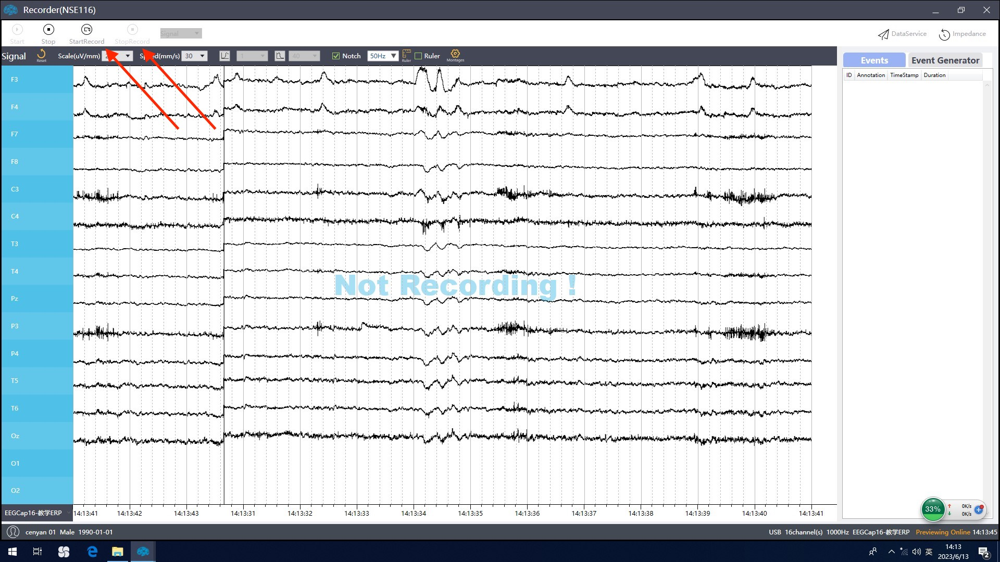

# 1 实验设备、数据采集
## 1.1 实验设备组成
实验设备的组成示意图见下


其中包含两台电脑（记为1与2）。电脑1用于运行ERP的图像展示程序，并同步事件发送信号到主机用以采集，由于涉及程序编写实验设计需自备；电脑2安装有Neuracle软件，用于实时收集并监测数据，并检查电极的阻抗，由实验室提供。

线材连接说明：
- 1为脑电帽输入，通过特殊接口直接与脑电帽连接。
- 2为电源线，直接连接市电电源。
- 3为串口输入，用于发送trigger信息，与电脑2通过USB-A相连。
- 4为数据线输出，用于实时将数据传输并记录于电脑，通过USB-A与电脑1相连。


## 1.2 脑电波测量说明
### 连接仪器
按照上节所述连接仪器。

### 注入导电膏
点击实验软件右上角的"Impedance"按钮，打开阻抗查看页面。


点开后的界面如图所示。可以通过选择`value`按钮显示阻抗值（单位为$\mathrm{k}\Omega$），并在右侧下拉菜单中选择颜色对应的阻抗数值范围，便于观察。没有注入导电膏打开此页面时，显示阻抗值在$10^4$量级，此为正常现象。


被试戴好脑电帽后，使用注射器将导电膏注入脑电帽电极位置的圆孔中，让电极与头皮间形成通路。注入后等待一小段时间（通常每个电极注入后需要等待5分钟左右），阻抗值会慢慢降低。若某个目标电极在注入导电膏之后阻抗值仍然偏高，可以尝试增加导电膏注入量，或将电极向头皮稍微按压；若所有电极的阻抗值均偏高，则可以尝试对**参考电极**进行上述操作。待全部电极上的导电膏电压均降到50 $\mathrm{k}\Omega$ 以下时，可开始实验。

此外，建议导电膏尽量按照一定顺序注入。
1. 首先注入**参考电极**（脑电帽上标注REF，图中Cz）以及**接地电极**（脑电帽上标注GND，图中Fz）。因为所测**目标电极**的电信号实际是**目标电极**与**参考电极**之间的电势差，阻抗计算也是二者之间的阻抗，因此需要先连接**参考电极**以及**接地电极**。
2. 由于脑电帽设计原因，该部分电极（主要图中O电极及P电极）距离头皮距离较远，而且注入导电膏时容易接触不良，尽量*先注入这部分*，让阻抗慢慢下降。


### 开始测量
> *注：此处仅给出开始记录与结束记录的方法以供参考，具体实验内容请自行设计。*

测量开始时，按下`start record`按钮，则开始记录脑电活动的信号直至按下`stop record`。



期间的脑电数据以 `.bdf` 格式存储。

### 查看、导出数据
点击`stop`按钮结束脑电波记录，重新打开软件刚开始时的界面。

# 2 图像刺激
## 2.0 环境配置
图像展示所需的程序位于`./1_image_stimuli/`下，并在电脑1中运行（参见上一章），并由`python`编写。请确保电脑1中装有3.8以上版本的python，并确保安装了以下库版本：

|库|版本|说明|
|--|--|--|
|numpy||
|psychopy|2023.1.0|专门用于心理测试的库，本实验中用于控制图像展示|
|pyglet|1.5.27\*|psychopy库的依赖项|
|mne|1.3.1|用于处理脑电波储存常用的`.bdf`类型的文件|

> \* *注：这个库是`psychopy`的依赖之一，截至2023/7/13，若该库为2.0或更高版本则会导致psychopy中的某个函数运行时报错。直接pip安装psychopy时默认安装版本较高，可能需要手动替换该库版本为较低版本，请格外注意。*

> *另注：由于图像刺激部分与训练部分所使用部分库版本不同，若电脑1同时用于测试训练部分，建议使用anaconda或pyenv等python版本管理软件，以切换不同python环境。*

## 2.1 文件说明
`1_image_stimuli/`目录下储存图像刺激相关代码，其主要文件大致如下：
```shell
├── img_stimuli_lib
│   ├── __init__.py
│   ├── imgshow.py
│   └── neuracle_lib
│       ├── __init__.py
│       ├── dataServer.py
│       ├── readbdfdata.py
│       └── triggerBox.py
├── main_imgstim.py
└── neuracle_lib
    ├── __init__.py
    ├── dataServer.py
    ├── readbdfdata.py
    └── triggerBox.py
```
> *注：此处`neuracle_lib`共有2个，是因为作者本人水平所限，在编写并调试程序时在不同的工作路径下为图省事，没有设置模块搜索路径，所以多复制了一份。*

其中`neuracle_lib`库为仪器设备厂家提供，在此主要用于实现发送触发信号（trigger）到设备。

在`img_stimuli_lib/imgshow.py`中主要定义了2个抽象类，`ImgLib`和`Trail`。

**而`main_imgstim.py`为主程序入口。开始实验时，调整并运行该脚本文件即可。**

#### `Trail`对象
`Trail`对象主要储存展示图像的相关参数（展示时间、两张图片的间隔），并定义了`start()`函数开始展示图像并同步将触发信号发送到设备。`Trail`对象初始化的时候必须接受一个`psychopy.visual.window`对象和一个`ImgLib`对象作为参数。关于前者请阅读psychopy的[官方文档](https://psychopy.org/coder/codeStimuli.html)，了解该第三方库的逻辑。其余参数等请见源代码中的docstring。

此外，若要将类别信息通过串口发送到实验设备上，则需要增加

#### `ImgLib`对象
`ImgLib`对象则用于按一定顺序将类别ID和图像路径提供给`Trail`对象。该类中需要包含2个主要的函数：`getid()`和`getimage()`。二者皆接受一个整形参数index作为输入，前者返回类别信息（触发信号，int），而后者则返回展示的图像路径（str）。

> 若需要重新设计实验，强烈建议阅读源代码，并定义一个`ImgLib`的子类，以更改返回图像的路径信息和类别信息。

> 若仅更改图像展示时的时长等参数，请在主程序中更改实例化`Trail`对象时的参数。

## 2.2 运行图像展示程序
准备工作：
- 确保python及库的版本环境配置正确，参见2.0节。
- **确保工作路径在`1_image_stimuli/`下**。
- **更改`main_imgstim.py`中的全局变量`IMG_ROOT_DIR`为ImageNet图片路径的父目录。**
- 确保每一个类别的图像的文件夹中都有一个`info.txt`文件，内容为`class, {class ID}`。如下所示
  ```shell
  IMG_ROOT_DIR
  ├── n01443537
  │   ├── info.txt            （内容为`class, 1`）
  │   ├── n02123597_10.JPEG
  │   ├── n02123597_12.JPEG
  │   ├── n02123597_25.JPEG
  │   └── ......
  └── n02123597
      ├── info.txt            （内容为`class, 2`）
      ├── n02492035_27.JPEG
      ├── n02492035_28.JPEG
      ├── n02492035_32.JPEG
      └── ......
  ```

准备完成后，运行`main_stimuli.py`（可以在5-10行选择是否发送触发信号）。
